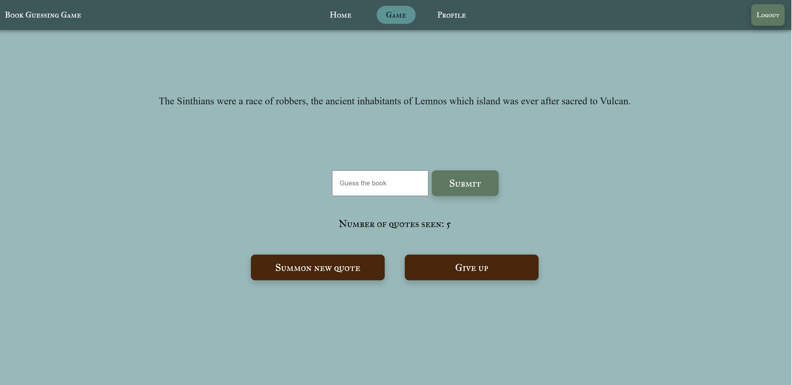
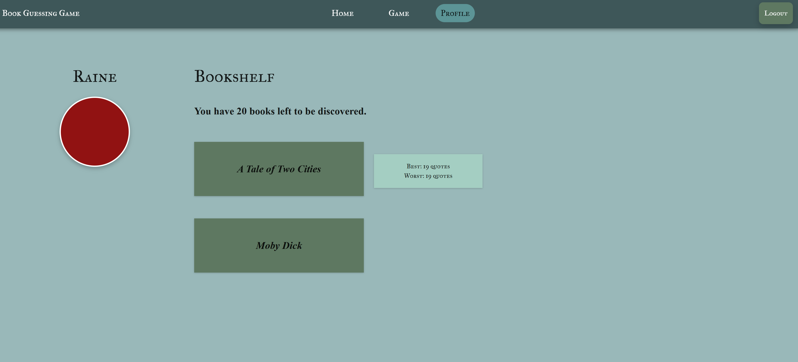

# BookGuessingGame

A web game where users can guess classic books based on randomly pulled quotes, track their scores, and explore book stats. Built with modern web technologies, this project showcases full-stack development skills, state management, and API integration.
## [Play the deployed game](https://bookguessinggame.onrender.com/)

  
  

---

## Technologies Used

- **Frontend:** React, TypeScript, CSS3  
- **Backend:** Node.js, Express  
- **Database:** MongoDB Atlas  
- **Routing & State Management:** React Router, React Context API / custom hooks  
- **Deployment:** Render (frontend & backend)  

---

## Features

- **Interactive Book Guessing:** Users can attempt to guess books based on random excerpts.  
- **User Accounts:** Register and log in to track guesses, high scores, and personalized stats.  
- **Persistent Storage:** MongoDB backend for user data and game history.  
- **Smooth UX:** Hover animations and interactive feedback.

---

## Planned Enhancements

- **Responsive Design:** Fully responsive layout for desktop and mobile devices.
- **Add user customization:** Allow users to customize font size, theme colors, accessibility settings, etc.  
- **Increase game size:** Add more books to database and improve excerpt retrieval.
- **Add social elements:** Integrate a leaderboard system.

