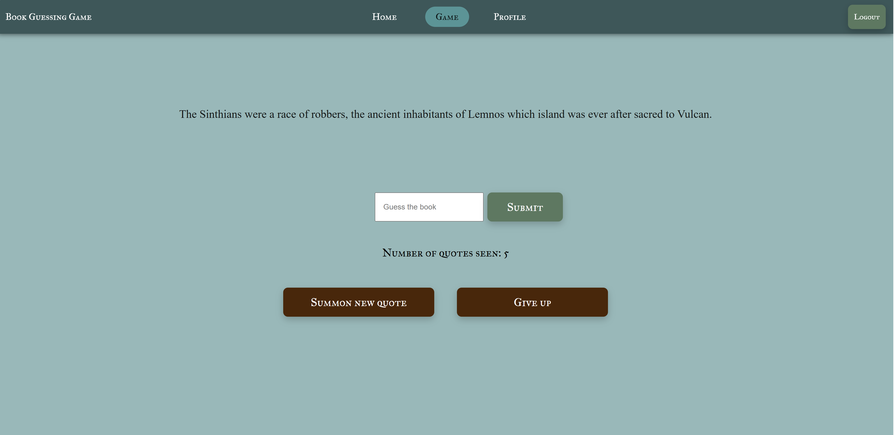
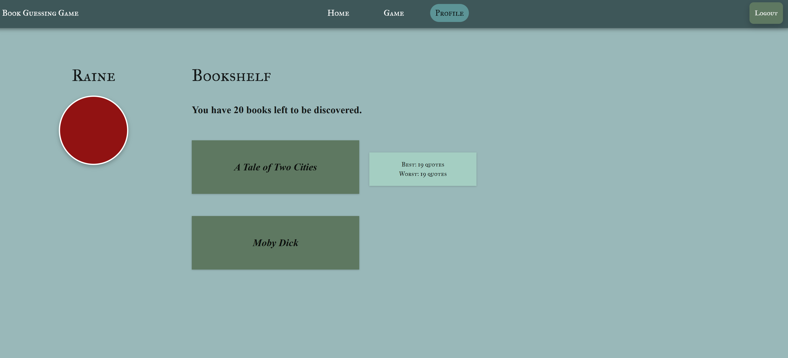
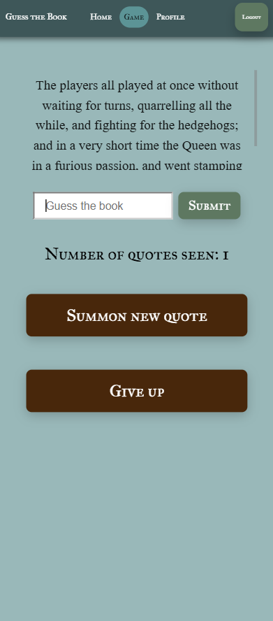

# BookGuessingGame

A full-stack, responsive web game where users test their literary knowledge by identifying classic books from randomly pulled quotes. Built with a modern TypeScript stack, it showcases full-stack development skills, state management, and API integration.

## [Play the deployed game](https://bookguessinggame.onrender.com/)

  
  

      
  

---
## Key Features 

- **Daily & Freeplay Guessing Modes:** Guess books from randomly selected quotes in a daily global challenge or unlimited, casual mode
- **Google OAuth Authentication:** One-tap sign-in integrated with server-side Express sessions.
- **Relational Data Persistence:** Structured PostgreSQL schema for books, user stats, and single-attempt daily challenges.
- **Responsive Architecture:** Customized layout and interactive feedback optimized for both desktop and mobile screens.

---

## Technologies Used

- **Frontend:** React, TypeScript, CSS3
- **Backend:** Node.js, Express
- **Database:** PostgreSQL
- **Routing & State Management:** React Router, React Context API / custom hooks
- **Deployment:** Render (frontend & backend)
---

## Planned Enhancements

- **Add user customization:** Allow users to customize font size, theme colors, accessibility settings, etc.
- **Increase game size:** Add more books to database and improve excerpt retrieval.
- **Add social elements:** Integrate a leaderboard system.
